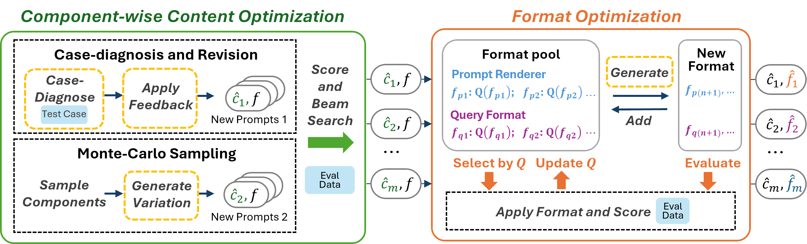

# CFPO
Welcome! This library provides the official implementation of our paper: Beyond Prompt Content: Enhancing LLM Performance via Content-Format Integrated Prompt Optimization.



## Usage


For multimodal groupwise registration, taking the BrainWeb data (`./core/data/BrainWeb/test.zip`) as an example, you could run `./core/trainers/Brainweb/BrainWebGroupRegTrainer.py` by the following code:

```shell
# Script to run GSM8K

current_time=$(date +"%Y%m%d%H%M%S")

python src/main.py \
       --task #TASK NAME #\
       --output_marker #LOG MARKER# \
       --train_size #TRAINING SIZE# \
       --minibatch_size #FOR DIAGNOSIS# \
       --valid_size #VAL SIZE# \
       --test_size #TEST SIZE# \
       --controller #SCHEDULAR# \
       --opt_llm #OPT_LLM# \
       --eval_llm #EVAL_LLM# \
       --vllm_pth #VLLM_LOCAL_PATH# \
       --init_temperature #INIT_TEMP# \
       --rounds #ROUNDS# \
       --beam_size #BEAM SIZE TO MAINTAIN# \
       --num_return #RETURN NUMBER OF OPTIMIZED PROMPTS# \
       --num_feedbacks #NUMBER OF PROMPTS GENERATED BY DIAGNOSIS# \
       --errors_per_feedback #NUMBER OF INCORRECT SAMPLE FOR DIAGNOSIS# \
       --correct_per_feedback #NUMBER OF CORRECT SAMPLE FOR DIAGNOSIS# \
       --apply_per_feedback #NUMBER OF SEARCHED PROMPT PER FEEDBACK# \
       --num_random 1 #NUMBER OF PROMPTS GENERATED BY MONTE-CARLO SAMPLING# \
       --num_format 1 #NUMBER OF PROMPTS GENERATED BY FORMAT MUTATION# \
       --select_method #SELECT METHOD FOR FORMAT# \
       --gpu_id 0 #SET GPU DEVICE ID## \
```

## Citation

If you find the code useful, please cite our paper as follows:

```bibtex
NOT AVAILABLE
```
